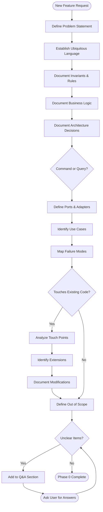

# Planning Flow

## Flowchart

## Rules

1. **No solutions or implementation details** — domain language only
2. **No code snippets** — plain language descriptions
3. **Be brief** — short explanations, only what's most relevant
4. **Use mermaid diagrams** when they clarify relationships or flows
5. **Socratic method** — don't guess, ask before proceeding
6. **If invariants are unclear** — add to questions.md and ask the user
