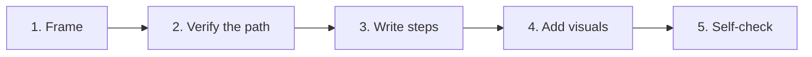
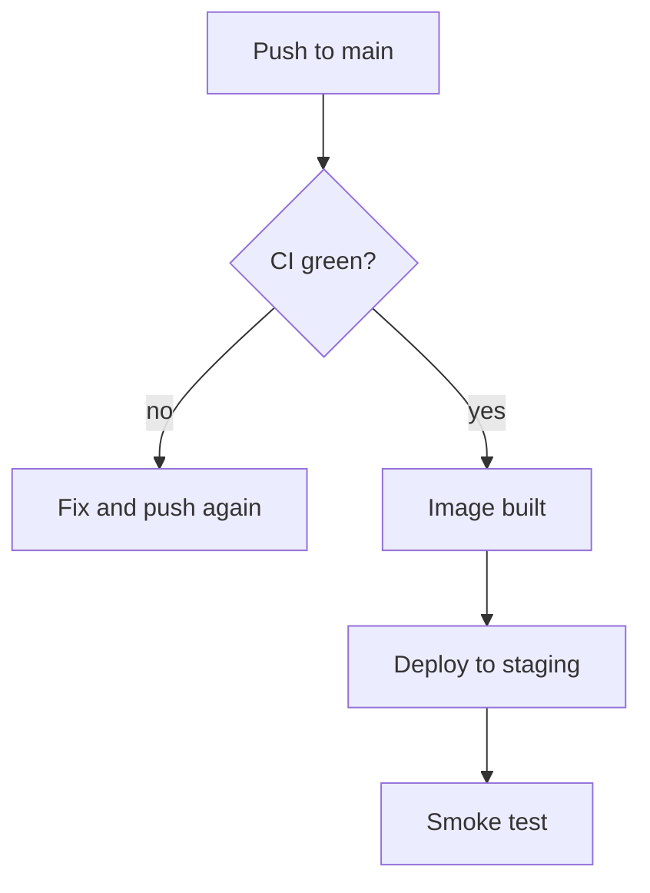

# Guide Writer

A guide is a path from where the reader is to where they want to be. Everything that is not the
path is noise. Method: **one reader, one goal, one path** — frame it, verify it, write it, check it.



## Step 1 — Frame: reader, goal, shape

Pin three facts before writing a word. Infer from context; ask via `AskUserQuestion` only for what
you cannot infer, and never more than two questions.

- **Reader** — one concrete person: "a backend dev on day 1 with repo access and Docker installed."
  Not "users". Everything they already know is cut; everything they lack is a prerequisite.
- **Goal** — one observable end state: "the API responds on staging." If the topic has two goals,
  write two guides and link them.
- **Shape** — pick one ([Diátaxis](https://diataxis.fr)); do not mix:

| Reader wants to…  | Shape       | Voice                        | Example title                 |
| ----------------- | ----------- | ---------------------------- | ----------------------------- |
| learn by doing    | Tutorial    | "We will… Now you have…"     | Your first deploy             |
| get a job done    | How-to      | "To X, do Y."                | Deploy the API to staging     |
| look something up | Reference   | facts, tables, no narrative  | Deploy config options         |
| understand why    | Explanation | prose, background, tradeoffs | How our deploy pipeline works |

Most requests are how-tos. Default to it unless the reader is a beginner (tutorial).

## Step 2 — Verify the path before writing it

Never write a step you have not seen work. Run the commands, read the code, open the UI, check the
config. Capture real output as you go — it becomes the "expected result" text and the screenshots.
If a step cannot be verified (no access, prod-only), mark it `> **Unverified:**` in the draft and
tell the user which ones.

## Step 3 — Write the steps

Copy `template.md` (next to this file) as the skeleton. Then apply these rules — they come from the
[Google developer documentation style guide](https://developers.google.com/style/procedures):

1. **Title is the goal, verb first.** "Rotate the database password", not "Password rotation".
2. **Intro is one or two sentences**: who this is for, what they will have at the end, how long it
   takes. No history, no marketing.
3. **Prerequisites are checkable.** "Docker ≥ 24 (`docker --version`)", not "a working Docker setup".
4. **One action per step, imperative mood.** "Click **Deploy**." Small menu chains may combine with
   `>`: "Go to **Settings > Secrets**."
5. **Location before action.** "In the `api/` directory, run…", not "Run… in the `api/` directory."
6. **Result follows action in the same step.** "Run `make deploy`. The output ends with `Deployed
api@<sha>`." Every command gets a code block; every code block that produces output shows it.
7. **Purpose before action when it helps.** "To skip tests, add `--no-test`."
8. **Optional steps start with `Optional:`.**
9. **7 ± 2 steps per section.** Longer? Split into H2 stages ("Build", "Deploy", "Verify").
10. **Cut** "simply", "just", "easily", "please", "note that", "in order to", "above/below/left".
11. **Define or link every term the reader might not know**, at first use. Don't explain it inline.
12. **Every page is page one.** The reader may land here from a search. State context in the
    intro, link out for depth, never say "as we saw earlier".

Bad → good:

```
❌ 3. Now you'll want to go ahead and configure the environment, which is important because
      the deploy script reads it. Set the vars in the file above.
✅ 3. In `api/.env.staging`, set `DATABASE_URL` and `API_KEY`. The deploy script reads this file.
```

End with **Verify** (how the reader proves it worked — a command and its expected output, or a
screenshot of the success state), **Troubleshooting** (symptom → cause → fix, only for failures you
saw or know are common), and **Next steps** (2–3 links).

## Step 4 — Add visuals where words fail

Pick the lightest medium that carries the information:

| Content                                       | Use                                   |
| --------------------------------------------- | ------------------------------------- |
| Commands, code, terminal output, config       | Text in a code block — never an image |
| A UI element that is hard to find or identify | Screenshot                            |
| Flow, sequence, decision, state, architecture | Mermaid diagram                       |
| Before/after of a UI change                   | Two screenshots, same crop            |

**Screenshots** — a sentence of text introduces every image ("The deploy panel shows three
environments:"), then the image, then a caption `**Figure N.** <complete sentence>`.

- Crop to the relevant panel plus ~20–30 px padding. Same OS, theme, zoom, and window size across
  the whole guide.
- Annotate with one color and numbered callouts; refer to callouts in the text ("click **Deploy**
  (1)"). No arrows pointing at three things at once — one screenshot, one point.
- Redact secrets, emails, and names with a solid 100 % block, never blur.
- Alt text ≤ 155 characters, a noun phrase or sentence, no "Image of".
- Never embed text that matters in an image; repeat it in the prose.
- **Capturing:** if the `claude-in-chrome` skill or a browser/screenshot tool is available, open the
  real UI at the step's state and capture it into `<guide-dir>/images/<nn>-<slug>.png`. Otherwise
  leave a placeholder the user can fulfill in one action:
  `<!-- screenshot 03-deploy-panel.png: Settings > Deployments, staging row, annotate Deploy button (1) -->`

**Diagrams** — Mermaid, inline in the markdown, one idea per diagram, ≤ 8 nodes, labels that match
the words in the steps. Pick the type by what the reader must see:

| Reader must see             | Mermaid type                         |
| --------------------------- | ------------------------------------ |
| steps and decision branches | `flowchart TD`                       |
| who talks to whom, in order | `sequenceDiagram`                    |
| lifecycle / status changes  | `stateDiagram-v2`                    |
| parts and how they connect  | `flowchart LR` with `subgraph` boxes |

Example placed in a how-to, right before the steps it summarizes:



Place a diagram once, where the reader first needs the mental model — usually right after the
intro or at the head of the stage it explains. Don't decorate; if the steps are already obvious,
skip it.

## Step 5 — Self-check, then deliver

Reread as the reader from Step 1, cold:

- Could they finish with only this page and the prerequisites? (every page is page one)
- Does every step start with a verb and name where the action happens?
- Does every command have its expected output or result?
- Is anything present that does not move the reader toward the goal? Cut it.
- Do images carry information text couldn't? Does every one have intro sentence, alt, caption?
- Is the title a verb phrase matching the goal? Does Verify prove the goal, not a proxy?
- Are unverified steps marked?

Then write the file to the path the user gave (default `docs/<slug>.md`, images in `docs/images/`).
Report in three lines: where it is, which steps were verified live vs. marked unverified, and which
screenshots are placeholders. Do not restate the guide.

## Sources

- [Diátaxis](https://diataxis.fr) — the four documentation shapes.
- [Google developer documentation style guide](https://developers.google.com/style) — procedures,
  images, and word choice.
- [Every Page is Page One](https://everypageispageone.com) — self-contained, context-setting topics.
- Carroll, _The Nurnberg Funnel_ — minimalism: action first, cut what the reader already knows.
