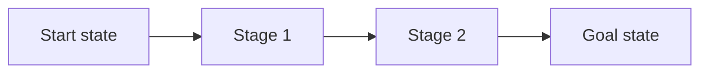

# <Verb phrase: what the reader will have done>

<One or two sentences: who this is for, what they will have at the end, how long it takes.>



## Before you start

- <Checkable prerequisite, with the command that checks it>
- <Access or permission the reader must already have>

## <Stage 1, verb phrase — omit stage headings if the whole guide is under ~9 steps>

1. In <location>, <action>. <Result the reader sees.>

   ```sh
   <command>
   ```

   ```
   <expected output>
   ```

2. <Action>. <Result.>

   <Sentence introducing the screenshot:>

   

   **Figure 1.** <Complete sentence describing what the figure shows.>

3. Optional: <action>. <When and why you would do this.>

## <Stage 2, verb phrase>

1. …

## Verify

<Command or check that proves the goal state, with its expected output.>

## Troubleshooting

| Symptom              | Cause                      | Fix          |
| -------------------- | -------------------------- | ------------ |
| `<exact error text>` | <what actually went wrong> | <one action> |

## Next steps

- [<Related guide>](link)
- [<Reference for the options used here>](link)
